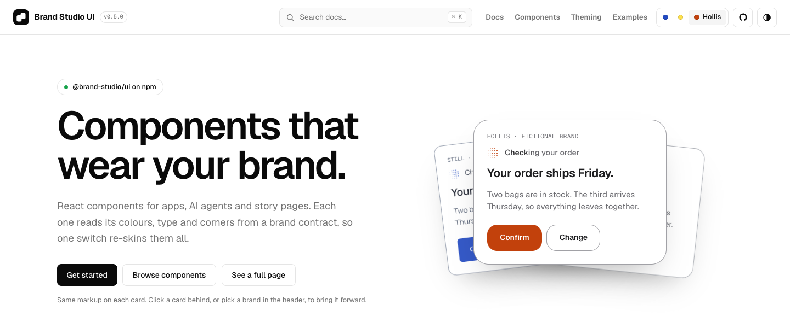

# Brand Studio

Brand Studio turns business facts and visitor purpose into a durable brand contract, then applies that contract across websites and other creative artifacts.

[](https://brandstudio.js.org/)

[Live docs](https://brandstudio.js.org/) · [Component catalogue](https://brandstudio.js.org/docs/) · [Examples](https://brandstudio.js.org/examples/) · [npm package](https://www.npmjs.com/package/@brand-studio/ui)

It combines a design workflow, an optional accessible React UI package and public examples in one workspace. The system preserves a brand's positioning, voice, typography, colour logic, imagery and signature devices without forcing every output into one visual template or package.

## Products

| Product | Location | Current status |
|---|---|---|
| Brand Studio UI | [packages/ui](packages/ui/README.md) | 56 typed React components for apps, AI agents, effects, story pages and product pages |
| Brand Studio plugin | [plugins/brand-studio](plugins/brand-studio/README.md) | Shared brand-design skill with Codex and Claude manifests |
| Showcase | [apps/showcase](apps/showcase/) | Interactive component library and completed brand studies |
| Docs | [apps/docs](apps/docs/) | Public component docs: live previews in any demo brand, props and copyable code |
| Public examples | [examples](examples/README.md) | Curated standalone proofs, currently focused on authored motion |

Install the published [`@brand-studio/ui`](https://www.npmjs.com/package/@brand-studio/ui) package with npm, pnpm, Yarn or Bun. Browse the [component documentation](https://brandstudio.js.org/docs/).

## Repository boundary

### Public and tracked

| Path | Public role |
|---|---|
| `packages/` | Reusable product code intended for packaging |
| `plugins/` | Portable workflow, contract references and deterministic validation |
| `apps/` | Runnable showcase and brand studies |
| `examples/` | Curated, standalone proofs that are safe to study publicly |
| `assets/` | Approved original master assets with documented provenance |
| `scripts/` and `tests/` | Reproducible tooling and automated checks |

### Private and ignored

| Path | Private role |
|---|---|
| `workbench/references/` | Third-party and internal code used only for evaluation; never relicense or publish wholesale |
| `workbench/` | Drafts, unfinished experiments, raw inputs and temporary creative work |
| `source-art/` | Default landing area for unreviewed downloads from the art-fetching script |
| `.playwright-*`, `output/`, `test-results/` | Browser captures and temporary test output |
| Root guidance files and `docs/` | Local architecture, roadmap, research, verification and release notes |
| `artifacts/` | Generated package archives and release candidates |

Do not move material from the workbench into a public path by copying it blindly. Reimplement only the necessary behavior, check the upstream licence and dependencies, and record the decision.

## Source and asset policy

Source material becomes public only after review:

- Approved generated masters live in `assets/masters/`; working prompts stay in local supporting notes.
- Runtime derivatives live beside the application that serves them, such as `apps/showcase/public/`.
- Redistributable third-party originals may live beside a public example only when an adjacent provenance file records the source URL, creator, work, rights statement and any transformation.
- Raw downloads, uncertain licences, campaign captures and upstream component code remain in `workbench/` or the ignored root `source-art/`.
- Original code licences do not automatically cover third-party or generated media.

## Architecture at a glance

> Business facts -> audience and purpose -> category evidence -> creative concept -> brand contract -> artifact -> verification

The UI package implements reusable React behavior. The plugin owns the decision workflow. The contract connects them without requiring an application to use that package. Each application owns its stack and dependencies; artifact-specific code may interpret the contract differently, but must not silently create a second palette, voice, image language or motion system.

## Run

Requires Node.js 22.12 or newer and npm.

```sh
npm install
npm run dev
```

Open the local URL printed by Vite. The root route shows Brand Studio and `/coffee` shows the Still study.

```sh
npm run check:brand
npm test
npm run build
npm run typecheck
npm run pack:ui
npm run pack:plugin
```

Build the UI before typechecking because showcase types resolve from `packages/ui/dist`.

## Updates and releases

Open a pull request against `main` for source or documentation changes. The required CI check builds the UI, showcase and docs, then runs typechecks, tests, brand validation and a package dry run. Merge once it passes.

For a new UI release, choose a version that has not been published. Update `packages/ui/package.json` and the exact `@brand-studio/ui` dependency in both app manifests, then run `npm install` to refresh `package-lock.json`. After the version change passes CI and merges, run **Publish UI to npm** from the Actions tab on `main`. This manual workflow uses npm trusted publishing and does not need a stored npm token. Confirm the result with `npm view @brand-studio/ui version` before announcing it.

The docs site uses Cloudflare Pages Direct Upload, so merging does not deploy it. After a docs change is merged, build and deploy the static output from the repository root:

```sh
npm run build:docs
npx wrangler pages deploy apps/docs/out --project-name brand-studio --branch main
```

`build:docs` also builds the showcase and copies it to `apps/docs/out/examples/`, so the same deploy publishes the [live examples](https://brandstudio.js.org/examples/). Check the [live docs](https://brandstudio.js.org/docs/) and examples after deployment.
